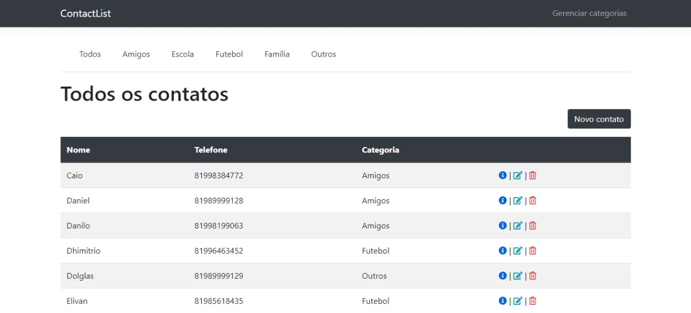

Desenvolvido para praticar os conhecimentos em .NET Core MVC com C#

# Contact List

* Contact List é um sistema simples de gerenciamento de contatos.
* Possui as funcionalidades de adicionar, editar e remover categorias e contatos.
* É possivel listar todos os contatos e listar os contatos filtrando por categoria.
* Foi desenvolvindo com .NET Core MVC e C#, usando a abordagem CodeFirst e o ORM Entity Framework Core  
* O SGBD usado foi o SQLServer e conta com 2 tabelas: Contatos e Categorias, onde possui orelacionamento 1 - n.
